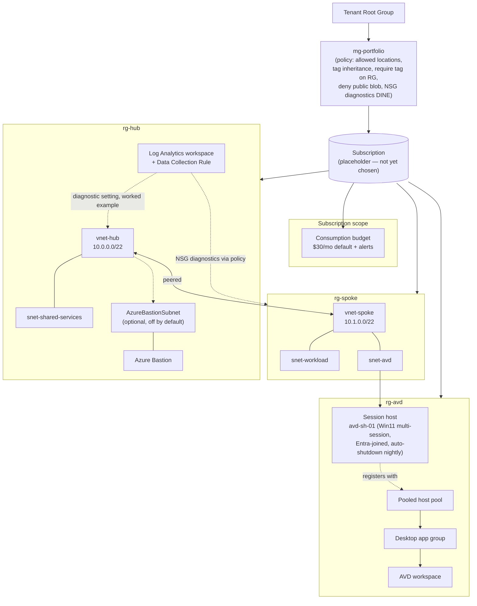

# Azure Landing Zone (Bicep)

[](https://github.com/ORG/REPO/actions/workflows/ci.yml)

> Badge is a placeholder — swap `ORG/REPO` for this repo's actual GitHub
> path once it has one (see "OIDC setup (TODO)" below for the same
> placeholder convention used elsewhere in this doc).

A miniature enterprise landing zone deployed 100% from code — management
group hierarchy, governance policy, hub-spoke networking, centralized
logging, an AVD pooled-desktop proof of concept, and cost controls — with
no portal clicks. Built as public engineering evidence and as a work asset
for Omnissa Horizon -> AVD/Windows 365 migration planning.

Status: **infrastructure-as-code complete, not yet deployed.** The target
subscription/tenant has not been chosen; every environment-specific value is
parameterized with an explicit placeholder (see the table below). See
[TODOs before first deploy](#todos-before-first-deploy).

## Architecture



Cost controls: the session host is deallocated nightly by default
(auto-shutdown schedule + `startVMOnConnect` to power back on for the next
connection), Azure Bastion only deploys when `deployBastion = true`, and a
consumption budget alerts at configurable thresholds (50% / 80% actual,
100% forecasted) of a **$30/month** default.

## Repo layout

```
infra/
  modules/
    management-groups.bicep   tenant scope   — mg-portfolio + subscription placement
    policy.bicep               mg scope       — allowed locations, tag inheritance,
                                                 require tag on RG, deny public blob,
                                                 NSG diagnostics DINE
    network-hub.bicep          rg scope       — hub NSGs, vnet-hub, optional Bastion,
                                                 hub vnet diagnostic setting (worked example)
    network-spoke.bicep        rg scope       — spoke NSGs, vnet-spoke
    network-peering.bicep      rg scope       — one-directional peering (called twice)
    network.bicep              subscription   — orchestrates the three modules above
    monitoring.bicep           rg scope       — Log Analytics workspace + DCR
    avd.bicep                  rg scope       — host pool, app group, workspace,
                                                 1 session host, Entra join, auto-shutdown
    avd-startvm-roleassignment.bicep
                                subscription   — grants startVMOnConnect's required role
    budget.bicep                subscription  — consumption budget + alerts
  main.managementgroup.bicep   tenant scope   — STAGE 1 entry point
  main.bicep                    subscription  — STAGE 2 entry point
  params/
    managementgroup.bicepparam                — params for STAGE 1
    dev.bicepparam                            — params for STAGE 2, dev
    prod.bicepparam                           — params for STAGE 2, prod
.github/workflows/
  ci.yml                       PR: bicep build/lint + PS parse-lint + gated what-if + PR comment
  deploy.yml                   dev branch: what-if only; master: gated real deploy
  stage1.yml                   workflow_dispatch only: gated STAGE 1 (tenant scope) deploy
scripts/
  teardown.ps1                 safe/targeted resource-group teardown
  session-host-deallocate-notes.md
```

## Deployment order

This project has **two deployment stages at two different Azure scopes**,
because a single Bicep file cannot mix `tenant`/`managementGroup` scope with
`resourceGroup`-scoped resources cleanly, and because they change at very
different frequencies (STAGE 1 is a rare, high-privilege operation; STAGE 2
is the everyday CI/CD path).

### STAGE 1 — one-time bootstrap (tenant scope)

```powershell
az deployment tenant create `
  --name azure-landing-zone-mg `
  --location uksouth `
  --template-file infra/main.managementgroup.bicep `
  --parameters infra/params/managementgroup.bicepparam
```

Or, from CI: run `.github/workflows/stage1.yml` via `workflow_dispatch`
(manual trigger only, gated the same way as `deploy.yml` — see "Repo
layout" above and "Prerequisites / permissions" below) rather than from an
operator's local machine.

Creates `mg-portfolio` under the tenant root group and assigns its
governance policies to it (inherited by anything placed underneath): four
unconditional policies on first run — allowed locations, tag inheritance,
require-a-tag-on-resource-groups, and deny public blob access — plus a
fifth, NSG diagnostics DINE, which activates once
`logAnalyticsWorkspaceResourceId` is supplied (i.e. after the first STAGE 2
deploy) and STAGE 1 is re-run. Also places the target subscription under
`mg-portfolio` once `subscriptionIdToPlace` is filled in. Requires
**Owner** (or Management Group Contributor + Policy Contributor) on the
parent management group, and **Owner** on the subscription being placed.

Re-run only when governance parameters change. If your tenant/CLI
combination rejects the nested management-group-scoped policy module,
fall back to deploying `modules/management-groups.bicep` and
`modules/policy.bicep` separately — see the comment at the top of
`main.managementgroup.bicep`.

**Operational notes for re-runs:**
- **Management group propagation lag**: policy assignments at management
  group scope can take several minutes to become effective tenant-wide
  after a deploy. If a "verify a policy denial" check (see TODOs below)
  doesn't show the expected deny immediately after STAGE 1 completes, wait
  a few minutes and re-check before assuming something is wrong.
- **`PrincipalNotFound` on the Modify/DINE policy role assignments**: the
  `inheritTagRoleAssignment` / `deployNsgDiagnosticsRoleAssignment` /
  `deployNsgDiagnosticsLogAnalyticsRoleAssignment` resources in
  `policy.bicep` reference the policy assignment's own just-created managed
  identity. Entra ID's replication of a brand-new service principal can lag
  behind the ARM control plane by a few seconds, which occasionally makes
  the very next role assignment in the same deployment fail with
  `PrincipalNotFound`. This is a known, transient Azure Policy limitation,
  not a template bug — simply re-run the STAGE 1 deployment (it is
  idempotent) and it succeeds once the identity has replicated.
- **Remediation tasks (manual step)**: Modify and DeployIfNotExists
  policies (tag inheritance, NSG diagnostics) only apply to *new or
  updated* resources going forward — they do not retroactively fix
  resources that already existed before the policy was assigned. After
  STAGE 1 completes, trigger a remediation task for each Modify/DINE
  assignment so existing resources are brought into compliance too:
  ```powershell
  az policy remediation create `
    --name remediate-inherit-tag-from-rg `
    --policy-assignment "/providers/Microsoft.Management/managementGroups/mg-portfolio/providers/Microsoft.Authorization/policyAssignments/inherit-tag-from-rg" `
    --management-group mg-portfolio
  ```
  (repeat for `deploy-nsg-diagnostics` once that policy is active). This is
  a manual, occasional step — not automated by any workflow in this repo.

### STAGE 2 — everyday deploy (subscription scope)

```powershell
az deployment sub create `
  --name azure-landing-zone `
  --location uksouth `
  --template-file infra/main.bicep `
  --parameters infra/params/dev.bicepparam `
  --parameters avdAdminPassword=$env:AVD_LOCAL_ADMIN_PASSWORD
```

Creates `rg-hub` / `rg-spoke` / `rg-avd` and deploys network, monitoring,
AVD, and the budget into them. This is what `deploy.yml` runs on every
push to `dev` (what-if only) and `master` (real deploy, environment-gated).
Requires **Contributor** (or narrower, resource-specific roles) on the
subscription, plus enough Graph/Entra permission for the AVD session host's
Entra join (the `AADLoginForWindows` VM extension itself needs no extra
Graph permission beyond what a normal VM deployment has — Entra join
happens via the extension's managed identity flow).

STAGE 2 depends on STAGE 1 only for policy to be *effective* (e.g. allowed
locations, deny-public-blob) — it does not read STAGE 1 outputs directly,
so it can be deployed before STAGE 1 if you want to validate the network
alone first; the policies just won't be enforced yet.

### Known limitation: `what-if` against a brand-new subscription

`az deployment sub what-if` fails with `ResourceGroupNotFound` (instead of
showing the "would create" plan) when the resource groups it's what-if-ing
against don't exist yet — see [Azure/bicep#14718](https://github.com/Azure/bicep/issues/14718).
This bites exactly the scenario this project cares most about: the very
first CI run against a fresh subscription, before `rg-hub`/`rg-spoke`/
`rg-avd` exist. `ci.yml` and `deploy.yml` both work around it with a tiny,
idempotent pre-step (`az group create --only-show-errors` for each of the
three resource groups) immediately before every `what-if` invocation, so
first-run CI is green instead of failing on a tooling limitation before it
ever gets to show a plan.

## Dev vs prod

Per the program's Azure convention, `dev` is **not** a separate Azure
environment/resource group family conceptually distinct from prod — it is
the same subscription-stage template (`main.bicep`) with a `dev`-suffixed
parameter set (`rg-hub-dev`, `rg-spoke-dev`, `rg-avd-dev`, separate LA
workspace name) so a dev "environment" can be validated with `what-if`
without ever colliding with the real resource group names. `deploy.yml`
only runs `what-if` for `dev` — it never actually deploys dev resources
automatically; do that manually if you want a real scratch environment.

## Prerequisites / permissions

- **Management group permissions**: Owner (or Management Group Contributor
  + Policy Contributor) on the tenant root group or whichever management
  group `mg-portfolio` nests under, for STAGE 1.
- **Subscription Owner** on the subscription being placed under
  `mg-portfolio` (required to create the
  `Microsoft.Management/managementGroups/subscriptions` alias resource).
- **Subscription Contributor** for STAGE 2 (resource group + resource
  creation).
- An Entra ID tenant that the target subscription trusts, for AVD Entra
  join (no on-prem AD / AD DS is used anywhere in this project).
- GitHub OIDC federated credentials for `azure/login` — see
  [OIDC setup (TODO)](#todos-before-first-deploy). No Azure secrets are
  stored in GitHub in the interim; every what-if/deploy job is gated on the
  `AZURE_OIDC_READY` repo variable until then (`deploy.yml`/`stage1.yml`
  print an explicit `::notice::` and skip their login/deploy steps;
  `ci.yml`'s what-if job is gated at the job level and simply shows as
  "skipped" in the Actions UI).
- **Resource provider registration**: a subscription that has never used a
  given resource type needs its provider explicitly registered before the
  first deploy — this project's providers are commonly registered by
  default, but `Microsoft.DesktopVirtualization` and
  `Microsoft.DevTestLab` in particular are frequently NOT registered on a
  brand-new subscription and will fail a first deploy with a
  `MissingSubscriptionRegistration` error rather than a clearer message.
  Register everything this project needs up front:
  ```powershell
  az provider register --namespace Microsoft.DesktopVirtualization
  az provider register --namespace Microsoft.DevTestLab
  az provider register --namespace Microsoft.Compute
  az provider register --namespace Microsoft.Network
  az provider register --namespace Microsoft.OperationalInsights
  az provider register --namespace Microsoft.Insights
  az provider register --namespace Microsoft.Consumption
  az provider register --namespace Microsoft.Authorization
  ```
  Registration is asynchronous and can take a few minutes; check status
  with `az provider show --namespace <name> --query registrationState`.

## Cost control

| Control | Where | Default |
|---|---|---|
| Session host auto-deallocate | `avd.bicep` (`Microsoft.DevTestLab/schedules`) | 19:00 UTC nightly |
| `startVMOnConnect` | `avd.bicep` host pool | `true` (auto-starts on demand; requires the role assignment below to actually work) |
| startVMOnConnect power-on role | `avd-startvm-roleassignment.bicep` (`avdServicePrincipalObjectId`) | `''` (skipped until filled in) |
| Azure Bastion | `network-hub.bicep` (`deployBastion`) | `false` |
| Log Analytics daily cap | `monitoring.bicep` (`dailyQuotaGb`) | 1 GB/day |
| VM size | `avd.bicep` (`vmSize`) | `Standard_D2s_v5` |
| Consumption budget + alerts | `budget.bicep` | $30/month, 50/80% actual + 100% forecasted |

See `scripts/session-host-deallocate-notes.md` for manual deallocate/start
commands and the reasoning for deallocate-over-delete between demos.

### Defender for Cloud pricing — deferred to v2

This project does **not** configure Microsoft Defender for Cloud pricing
tiers (`Microsoft.Security/pricings`) anywhere. That's a deliberate scope
decision, not an oversight: the paid Defender plans (Servers, Storage,
etc.) bill continuously per-resource regardless of whether the resources
they protect are actually running, which conflicts with this project's
cost-control goal of a near-zero standing cost between demos (session host
deallocated nightly, Bastion off by default). Enabling Defender plans is
straightforward to add later (a `policy.bicep`-style module assigning
`Microsoft.Security/pricings@2023-01-01` per plan) once this stops being a
personal portfolio/demo project and the always-on cost is justified by
actually running production workloads.

## Placeholders you must supply

Every value below is either an inert default (safe to compile, unsafe to
rely on) or empty on purpose. Nothing here is a secret that got committed —
secrets (the AVD local admin password, Azure federated credential IDs) are
**not** in this repo at all; see the OIDC/secret rows.

| Placeholder | File | Current default | Action needed |
|---|---|---|---|
| Target subscription ID | `infra/params/managementgroup.bicepparam` (`subscriptionIdToPlace`) | `''` (empty — skipped) | Fill in once subscription is chosen |
| Tenant / parent management group ID | `infra/main.managementgroup.bicep` (`parentManagementGroupId`) | tenant root group (auto) | Override only if nesting under an existing `mg-platform` |
| Allowed Azure regions | `infra/params/managementgroup.bicepparam` (`allowedLocations`) | `uksouth`, `ukwest` | Confirm against your actual target regions |
| Admin/trusted source CIDR | `infra/params/dev.bicepparam` / `prod.bicepparam` (`trustedAdminSourceCidr`) | `192.0.2.0/24` (TEST-NET-1, genuinely non-routable — a prior `10.0.0.0/8` default was NOT actually inert) | Replace with your real admin egress IP (`/32`) before relying on the NSG rule |
| AVD local admin password | `deploy.yml`/`ci.yml` (`AVD_LOCAL_ADMIN_PASSWORD` secret, passed via `env:`) / `main.bicep` (`avdAdminPassword`, `@minLength(12)`, required) | inert 12+ char placeholder via `readEnvironmentVariable()` in the bicepparam files | Create the GitHub secret before deploying |
| AVD service principal object ID (for startVMOnConnect) | `infra/params/dev.bicepparam` / `prod.bicepparam` (`avdServicePrincipalObjectId`) | `''` (role assignment skipped) | Look up with `az ad sp list --display-name "Azure Virtual Desktop" --query "[0].id" -o tsv` once AVD has been used at least once in the tenant, then fill in |
| Budget contact email(s) | `infra/params/dev.bicepparam` / `prod.bicepparam` (`budgetContactEmails`) | `CHANGE_ME@example.com` | Replace with a real distribution list |
| Budget start date | `infra/params/dev.bicepparam` / `prod.bicepparam` (`budgetStartDate`) | `2026-07-01` (fixed literal, no default in `budget.bicep`) | Update only if intentionally recreating the budget — Consumption budgets treat `startDate` as immutable after creation |
| Central LA workspace ID for NSG diagnostics policy | `infra/params/managementgroup.bicepparam` (`logAnalyticsWorkspaceResourceId`) | `''` (policy skipped) | Fill in after the first STAGE 2 deploy produces the workspace, then re-run STAGE 1 |
| AVD agent DSC package URL | `avd.bicep` (`avdAgentDscPackageUrl`) | a specific Microsoft-hosted version | Verify current URL at Microsoft Learn before deploying (Microsoft rotates this periodically) |
| OIDC app registration / federated credential | GitHub secrets `AZURE_CLIENT_ID`, `AZURE_TENANT_ID`; GitHub Variables `AZURE_SUBSCRIPTION_ID_DEV`, `AZURE_SUBSCRIPTION_ID_PROD` (not secrets — subscription IDs aren't sensitive) | not set | See TODOs below |
| `AZURE_OIDC_READY` repo variable | GitHub repo Settings > Variables | not set (`what-if`/deploy jobs skip) | Set to `true` once the above secrets/variables exist |
| `production` GitHub Environment + required reviewers | GitHub repo Settings > Environments | not configured | Create before the first `master` deploy (also gates `stage1.yml`) |

## TODOs before first deploy

1. **Choose the target subscription and tenant.** Nothing in this repo
   assumes one — fill in `subscriptionIdToPlace`, confirm `allowedLocations`,
   and confirm the region used by `deploy.yml`'s `--location` flag
   (hoisted to the `AZURE_LOCATION` workflow-level env var in `ci.yml` /
   `deploy.yml` / `stage1.yml`).
2. **OIDC setup**: register an Entra app, add exactly three federated
   credentials scoped to this repo:
   - `repo:ORG/REPO:pull_request` — for `ci.yml`'s what-if job, which runs
     on pull_request events against both `master` and `dev`.
   - `repo:ORG/REPO:ref:refs/heads/dev` — for `deploy.yml`'s `what-if-dev`
     job, which runs on push to `dev`.
   - `repo:ORG/REPO:environment:production` — for `deploy.yml`'s
     `deploy-prod` job and `stage1.yml`, both of which run under the
     `production` GitHub Environment.

   grant the app Contributor on the target subscription (+ the MG
   permissions above for STAGE 1 runs via `stage1.yml`), then set the
   `AZURE_CLIENT_ID` / `AZURE_TENANT_ID` secrets, the
   `AZURE_SUBSCRIPTION_ID_DEV` / `AZURE_SUBSCRIPTION_ID_PROD` repo
   variables, and flip `AZURE_OIDC_READY` to `true`.
3. **First deploy**: run STAGE 1 once — either manually (tenant scope,
   human-operated — see above) or via `.github/workflows/stage1.yml`
   (`workflow_dispatch`, gated by the `production` Environment and the
   `confirm` input), confirm the policy assignments show as effective
   (allow for management group propagation lag — see "Operational notes
   for re-runs" above), then let `deploy.yml` run STAGE 2 on the next push
   to `dev` (what-if) and, after review, `master` (real deploy,
   environment-approved). **This is what makes the full environment —
   tenant scope through resource groups — reachable end-to-end from CI**,
   not just from an operator's local machine.
4. **Verify a policy denial**: try deploying a storage account with
   `allowBlobPublicAccess: true` (or a resource outside `allowedLocations`)
   against the subscription after STAGE 1 — it should be denied. This is
   the plan's acceptance criterion for the policy module.
5. **AVD sign-in test**: after STAGE 2, assign an Entra user/group to the
   `ag-portfolio-desktop` application group (`Desktop Virtualization User`
   role on the app group), **and** assign that same user/group the
   **Virtual Machine User Login** role on the session host VM (or its
   resource group) — Entra-joined session hosts require this
   Azure-RBAC-based sign-in role in addition to the AVD application-group
   role; without it, sign-in fails even though the desktop is assigned.
   Then sign in via the AVD web client.

## Local validation performed

`az bicep build` (v0.42.1, bundled with Azure CLI 2.86.0) was run against
every entry point, every module file individually, and `az bicep
build-params` against every `.bicepparam` file — all compile with zero
warnings and zero errors. `scripts/teardown.ps1` (and every other `.ps1`
file in `scripts/`) was parse-validated with
`[System.Management.Automation.Language.Parser]::ParseFile()` — zero
errors; `ci.yml` now runs this same check on every PR that touches
`scripts/**`. This is all local/offline validation only; it does not call
Azure and does not substitute for `what-if`/`deploy` against a real
subscription.
