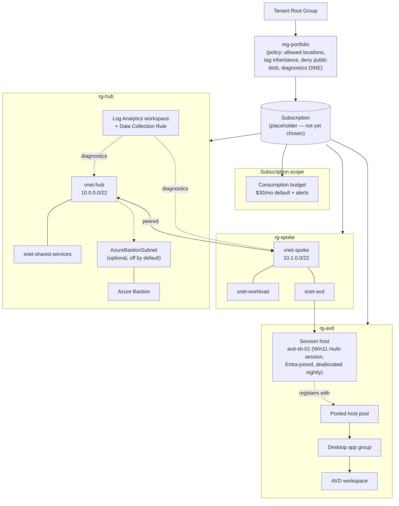

# Azure Landing Zone (Bicep)

A miniature enterprise landing zone deployed 100% from code — management
group hierarchy, governance policy, hub-spoke networking, centralized
logging, an AVD pooled-desktop proof of concept, and cost controls — with
no portal clicks. Built as public engineering evidence and as a work asset
for Omnissa Horizon -> AVD/Windows 365 migration planning.

Status: **infrastructure-as-code complete, not yet deployed.** The target
subscription/tenant has not been chosen; every environment-specific value is
parameterized with an explicit placeholder (see the table below). See
[TODOs before first deploy](#todos-before-first-deploy).

## Architecture



Cost controls: the session host is deallocated by default (nightly
auto-shutdown schedule + `startVMOnConnect`), Azure Bastion only deploys
when `deployBastion = true`, and a consumption budget alerts at configurable
thresholds (50% / 80% actual, 100% forecasted) of a **$30/month** default.

## Repo layout

```
infra/
  modules/
    management-groups.bicep   tenant scope   — mg-portfolio + subscription placement
    policy.bicep               mg scope       — allowed locations, tag inheritance,
                                                 deny public blob, NSG diagnostics DINE
    network-hub.bicep          rg scope       — hub NSGs, vnet-hub, optional Bastion
    network-spoke.bicep        rg scope       — spoke NSGs, vnet-spoke
    network-peering.bicep      rg scope       — one-directional peering (called twice)
    network.bicep              subscription   — orchestrates the three modules above
    monitoring.bicep           rg scope       — Log Analytics workspace + DCR
    avd.bicep                  rg scope       — host pool, app group, workspace,
                                                 1 session host, Entra join, auto-shutdown
    budget.bicep                subscription  — consumption budget + alerts
  main.managementgroup.bicep   tenant scope   — STAGE 1 entry point
  main.bicep                    subscription  — STAGE 2 entry point
  params/
    managementgroup.bicepparam                — params for STAGE 1
    dev.bicepparam                            — params for STAGE 2, dev
    prod.bicepparam                           — params for STAGE 2, prod
.github/workflows/
  ci.yml                       PR: bicep build/lint + gated what-if + PR comment
  deploy.yml                   dev branch: what-if only; master: gated real deploy
scripts/
  teardown.ps1                 safe/targeted resource-group teardown
  session-host-deallocate-notes.md
```

## Deployment order

This project has **two deployment stages at two different Azure scopes**,
because a single Bicep file cannot mix `tenant`/`managementGroup` scope with
`resourceGroup`-scoped resources cleanly, and because they change at very
different frequencies (STAGE 1 is a rare, high-privilege operation; STAGE 2
is the everyday CI/CD path).

### STAGE 1 — one-time bootstrap (tenant scope)

```powershell
az deployment tenant create `
  --name azure-landing-zone-mg `
  --location uksouth `
  --template-file infra/main.managementgroup.bicep `
  --parameters infra/params/managementgroup.bicepparam
```

Creates `mg-portfolio` under the tenant root group and assigns the four
governance policies to it (inherited by anything placed underneath). Also
places the target subscription under `mg-portfolio` once
`subscriptionIdToPlace` is filled in. Requires **Owner** (or Management
Group Contributor + Policy Contributor) on the parent management group, and
**Owner** on the subscription being placed.

Re-run only when governance parameters change. If your tenant/CLI
combination rejects the nested management-group-scoped policy module,
fall back to deploying `modules/management-groups.bicep` and
`modules/policy.bicep` separately — see the comment at the top of
`main.managementgroup.bicep`.

### STAGE 2 — everyday deploy (subscription scope)

```powershell
az deployment sub create `
  --name azure-landing-zone `
  --location uksouth `
  --template-file infra/main.bicep `
  --parameters infra/params/dev.bicepparam `
  --parameters avdAdminPassword=$env:AVD_ADMIN_PASSWORD
```

Creates `rg-hub` / `rg-spoke` / `rg-avd` and deploys network, monitoring,
AVD, and the budget into them. This is what `deploy.yml` runs on every
push to `dev` (what-if only) and `master` (real deploy, environment-gated).
Requires **Contributor** (or narrower, resource-specific roles) on the
subscription, plus enough Graph/Entra permission for the AVD session host's
Entra join (the `AADLoginForWindows` VM extension itself needs no extra
Graph permission beyond what a normal VM deployment has — Entra join
happens via the extension's managed identity flow).

STAGE 2 depends on STAGE 1 only for policy to be *effective* (e.g. allowed
locations, deny-public-blob) — it does not read STAGE 1 outputs directly,
so it can be deployed before STAGE 1 if you want to validate the network
alone first; the policies just won't be enforced yet.

## Dev vs prod

Per the program's Azure convention, `dev` is **not** a separate Azure
environment/resource group family conceptually distinct from prod — it is
the same subscription-stage template (`main.bicep`) with a `dev`-suffixed
parameter set (`rg-hub-dev`, `rg-spoke-dev`, `rg-avd-dev`, separate LA
workspace name) so a dev "environment" can be validated with `what-if`
without ever colliding with the real resource group names. `deploy.yml`
only runs `what-if` for `dev` — it never actually deploys dev resources
automatically; do that manually if you want a real scratch environment.

## Prerequisites / permissions

- **Management group permissions**: Owner (or Management Group Contributor
  + Policy Contributor) on the tenant root group or whichever management
  group `mg-portfolio` nests under, for STAGE 1.
- **Subscription Owner** on the subscription being placed under
  `mg-portfolio` (required to create the
  `Microsoft.Management/managementGroups/subscriptions` alias resource).
- **Subscription Contributor** for STAGE 2 (resource group + resource
  creation).
- An Entra ID tenant that the target subscription trusts, for AVD Entra
  join (no on-prem AD / AD DS is used anywhere in this project).
- GitHub OIDC federated credentials for `azure/login` — see
  [OIDC setup (TODO)](#todos-before-first-deploy). No Azure secrets are
  stored in GitHub in the interim; the what-if/deploy jobs simply skip with
  an explicit notice until `AZURE_OIDC_READY` is set to `true`.

## Cost control

| Control | Where | Default |
|---|---|---|
| Session host auto-deallocate | `avd.bicep` (`Microsoft.DevTestLab/schedules`) | 19:00 UTC nightly |
| `startVMOnConnect` | `avd.bicep` host pool | `true` (auto-starts on demand) |
| Azure Bastion | `network.bicep` (`deployBastion`) | `false` |
| Log Analytics daily cap | `monitoring.bicep` (`dailyQuotaGb`) | 1 GB/day |
| VM size | `avd.bicep` (`vmSize`) | `Standard_D2s_v5` |
| Consumption budget + alerts | `budget.bicep` | $30/month, 50/80% actual + 100% forecasted |

See `scripts/session-host-deallocate-notes.md` for manual deallocate/start
commands and the reasoning for deallocate-over-delete between demos.

## Placeholders you must supply

Every value below is either an inert default (safe to compile, unsafe to
rely on) or empty on purpose. Nothing here is a secret that got committed —
secrets (the AVD local admin password, Azure federated credential IDs) are
**not** in this repo at all; see the OIDC/secret rows.

| Placeholder | File | Current default | Action needed |
|---|---|---|---|
| Target subscription ID | `infra/params/managementgroup.bicepparam` (`subscriptionIdToPlace`) | `''` (empty — skipped) | Fill in once subscription is chosen |
| Tenant / parent management group ID | `infra/main.managementgroup.bicep` (`parentManagementGroupId`) | tenant root group (auto) | Override only if nesting under an existing `mg-platform` |
| Allowed Azure regions | `infra/params/managementgroup.bicepparam` (`allowedLocations`) | `uksouth`, `ukwest` | Confirm against your actual target regions |
| Admin/trusted source CIDR | `infra/params/dev.bicepparam` / `prod.bicepparam` (`trustedAdminSourceCidr`) | `10.0.0.0/8` (inert RFC1918 range) | Replace with your real admin egress IP (`/32`) before relying on the NSG rule |
| AVD local admin password | `deploy.yml` (`AVD_LOCAL_ADMIN_PASSWORD` secret) / `avd.bicep` (`adminPassword`) | `''` (deploy-time only) | Create the GitHub secret before deploying |
| Budget contact email(s) | `infra/params/dev.bicepparam` / `prod.bicepparam` (`budgetContactEmails`) | `CHANGE_ME@example.com` | Replace with a real distribution list |
| Central LA workspace ID for NSG diagnostics policy | `infra/params/managementgroup.bicepparam` (`logAnalyticsWorkspaceResourceId`) | `''` (policy skipped) | Fill in after the first STAGE 2 deploy produces the workspace, then re-run STAGE 1 |
| AVD agent DSC package URL | `avd.bicep` (`avdAgentDscPackageUrl`) | a specific Microsoft-hosted version | Verify current URL at Microsoft Learn before deploying (Microsoft rotates this periodically) |
| OIDC app registration / federated credential | GitHub secrets `AZURE_CLIENT_ID`, `AZURE_TENANT_ID`, `AZURE_SUBSCRIPTION_ID_DEV`, `AZURE_SUBSCRIPTION_ID_PROD` | not set | See TODOs below |
| `AZURE_OIDC_READY` repo variable | GitHub repo Settings > Variables | not set (`what-if`/deploy jobs skip) | Set to `true` once the above secrets exist |
| `production` GitHub Environment + required reviewers | GitHub repo Settings > Environments | not configured | Create before the first `master` deploy |

## TODOs before first deploy

1. **Choose the target subscription and tenant.** Nothing in this repo
   assumes one — fill in `subscriptionIdToPlace`, confirm `allowedLocations`,
   and confirm the region used by `deploy.yml`'s `--location` flag.
2. **OIDC setup**: register an Entra app, add a federated credential scoped
   to this repo (`repo:<org>/azure-landing-zone:ref:refs/heads/dev` and
   `...:ref:refs/heads/master`, or an Environment-scoped subject for
   `production`), grant it Contributor on the target subscription (+ the MG
   permissions above for a one-off manual STAGE 1 run), then set the
   `AZURE_CLIENT_ID` / `AZURE_TENANT_ID` / `AZURE_SUBSCRIPTION_ID_DEV` /
   `AZURE_SUBSCRIPTION_ID_PROD` secrets and flip `AZURE_OIDC_READY` to
   `true`.
3. **First deploy**: run STAGE 1 manually once (tenant scope, human-operated
   — see above), confirm the policy assignments show as effective, then let
   `deploy.yml` run STAGE 2 on the next push to `dev` (what-if) and, after
   review, `master` (real deploy, environment-approved).
4. **Verify a policy denial**: try deploying a storage account with
   `allowBlobPublicAccess: true` (or a resource outside `allowedLocations`)
   against the subscription after STAGE 1 — it should be denied. This is
   the plan's acceptance criterion for the policy module.
5. **AVD sign-in test**: after STAGE 2, assign an Entra user/group to the
   `ag-portfolio-desktop` application group (`Desktop Virtualization User`
   role on the app group), then sign in via the AVD web client.

## Local validation performed

`az bicep build` (v0.42.1, bundled with Azure CLI 2.86.0) was run against
every entry point, every module file individually, and `az bicep
build-params` against every `.bicepparam` file — all compile with zero
warnings and zero errors. This is a local, offline compile only; it does
not call Azure and does not substitute for `what-if`/`deploy` against a real
subscription.
